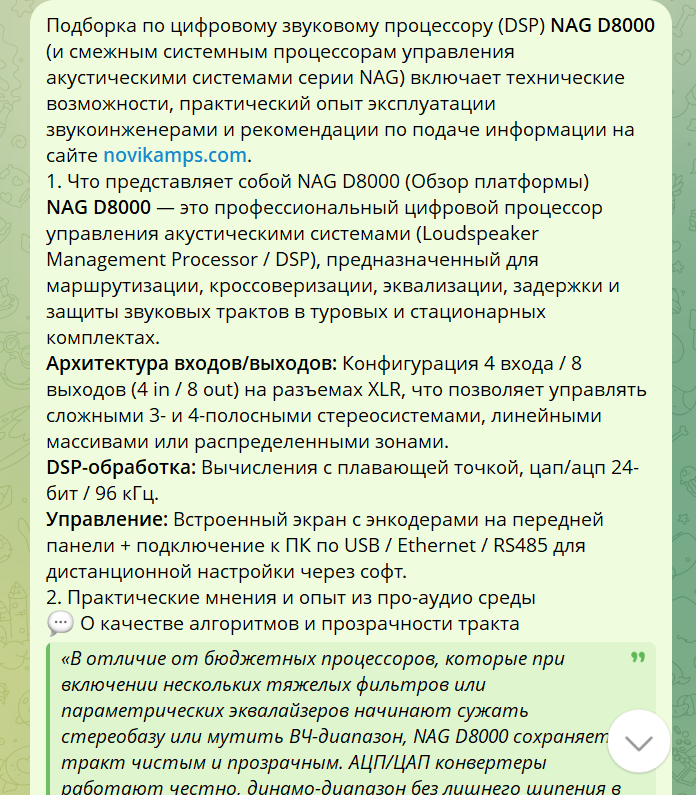
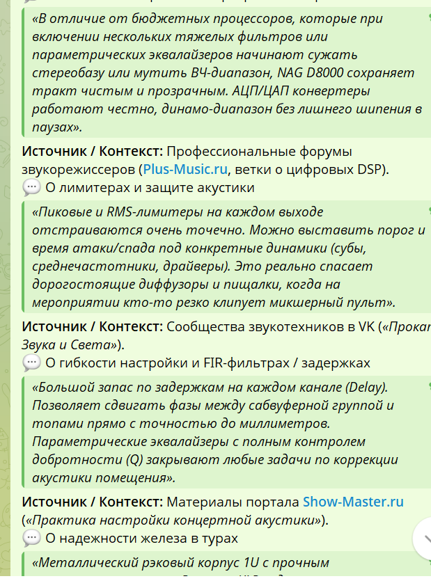
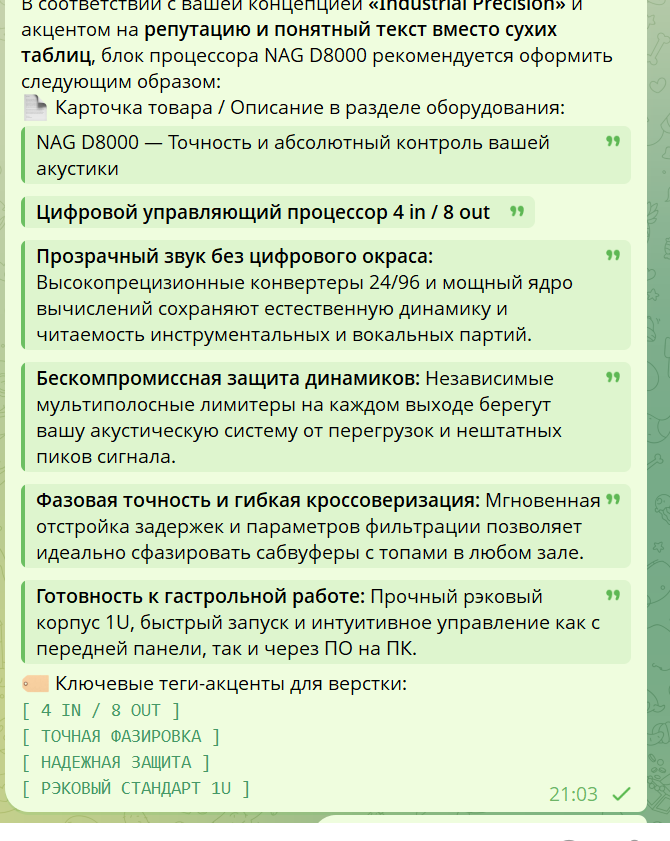

# NAG D8000 — сырой материал для блока «Процессоры»

Статус: черновик. Здесь сохранены исходные скриншоты и их расшифровка для дальнейшей редакторской работы. Публиковать фрагменты на сайт без отдельного согласования не следует.

## Исходные скриншоты

## Расшифровка: обзор платформы

Подборка по цифровому звуковому процессору (DSP) NAG D8000 и смежным системным процессорам управления акустическими системами серии NAG включает технические возможности, практический опыт эксплуатации звукоинженерами и рекомендации по подаче информации на сайте novikamps.com.

### 1. Что представляет собой NAG D8000

NAG D8000 — это профессиональный цифровой процессор управления акустическими системами (Loudspeaker Management Processor / DSP), предназначенный для маршрутизации, кроссоверизации, эквализации, задержки и защиты звуковых трактов в туровых и стационарных комплектах.

- **Архитектура входов/выходов:** конфигурация 4 входа / 8 выходов (4 in / 8 out) на разъёмах XLR; позволяет управлять сложными 3- и 4-полосными стереосистемами, линейными массивами и распределёнными зонами.
- **DSP-обработка:** вычисления с плавающей точкой, ЦАП/АЦП 24-бит / 96 кГц.
- **Управление:** встроенный экран с энкодерами на передней панели, подключение к ПК по USB / Ethernet / RS485 для дистанционной настройки через софт.

### 2. Практические мнения и опыт из про-аудио среды

#### О качестве алгоритмов и прозрачности тракта

> «В отличие от бюджетных процессоров, которые при включении нескольких тяжёлых фильтров или параметрических эквалайзеров начинают сужать стереобазу или мутить ВЧ-диапазон, NAG D8000 сохраняет тракт чистым и прозрачным. АЦП/ЦАП конвертеры работают честно, динамико-диапазон без лишнего шипения в паузах».

Источник / контекст: профессиональные форумы звукорежиссёров (Plus-Music.ru, ветки о цифровых DSP).

#### О лимитерах и защите акустики

> «Пиковые и RMS-лимитеры на каждом выходе отстраиваются очень точно. Можно выставить порог и время атаки/спада под конкретные динамики (сабы, среднечастотники, драйверы). Это реально спасает дорогущие диффузоры и пищалки, когда на мероприятии кто-то резко клинет микшерный пульт».

Источник / контекст: сообщества звукотехников во «ВКонтакте» («Прокат Звука и Света»).

#### О гибкости настройки, FIR-фильтрах и задержках

> «Большой запас по задержкам на каждом канале (Delay). Позволяет сдвигать фазы между сабвуферной группой и топами прямо с точностью до миллиметров. Параметрический эквалайзер с полным контролем добротности (Q) закрывают любые задачи по коррекции акустики помещения».

Источник / контекст: материалы портала Show-Master.ru («Практика настройки концертной акустики»).

#### О надёжности железа в турах

Исходный скриншот содержит начало следующего раздела: «Металлический рэковый корпус 1U с прочным …». Полный фрагмент требуется дополнить из первоисточника.

## Предлагаемая структура карточки товара

**Заголовок:** NAG D8000 — точность и абсолютный контроль вашей акустики.

**Подзаголовок:** цифровой управляющий процессор 4 in / 8 out.

1. **Прозрачный звук без цифрового окраса.** Высококачественные конвертеры 24/96 и мощный DSP сохраняют естественную динамику и читаемость инструментальных и вокальных партий.
2. **Бескомпромиссная защита динамиков.** Независимые мультиполосные лимитеры на каждом выходе берегут акустическую систему от перегрузок и нештатных пиков сигнала.
3. **Фазовая точность и гибкая кроссоверизация.** Мгновенная отстройка задержек и параметров фильтрации позволяет идеально сфазировать сабвуферы с топами в любом зале.
4. **Готовность к гастрольной работе.** Прочный рэковый корпус 1U, быстрый запуск и интуитивное управление как с передней панели, так и через ПО на ПК.

### Ключевые теги для вёрстки

- `[ 4 IN / 8 OUT ]`
- `[ ТОЧНАЯ ФАЗИРОВКА ]`
- `[ НАДЁЖНАЯ ЗАЩИТА ]`
- `[ РЭКОВЫЙ СТАНДАРТ 1U ]`

## Редакторские пометки

- Цитаты и указанные источники пока сохранены как сырой материал со скриншотов; перед публикацией необходимо найти первичные ссылки и подтвердить формулировки.
- Формулировки о FIR-фильтрах, типах конвертеров и интерфейсах требуют сверки с паспортом именно NAG D8000.
